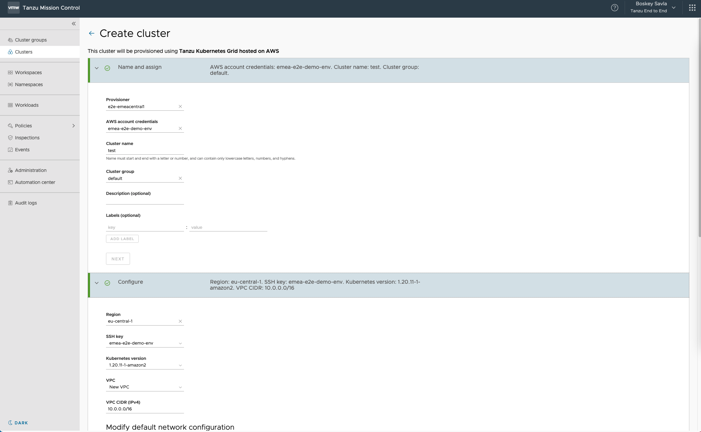
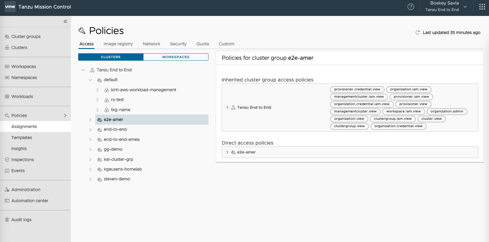

Building Kubernetes clusters on various cloud/infrastructure environments can be a non-trivial task and from an operations perspective, there are many things to consider.

1. What operating system should be used to build clusters nodes and what packages should be in them to make the nodes secure by default?
2. Since Kubernetes needs different drivers for various cloud providers to enable storage and networking consumption, each cluster on a cloud provider needs different packages to be installed, how does one automate all of this?
3. Once these clusters are created, how do you provide development teams authorized access to the Kubernetes API? The Kubernetes API is pretty powerful and can make infrastructure changes.
4. Since Kubernetes lets development teams provision storage and networking objects, how do you ensure consistent capacity management?

Tanzu for Kubernetes Operations provides automated solution to make provisioning Kubernetes clusters simple, secure and efficient.

## Provision Kubernetes Clusters via Tanzu Kubernetes Grid

**Tanzu Kubernetes Grid** will help automate the Provisioning of Clusters on various Public/Hybrid or Datacenter Environments. Tanzu Kubernetes Grid Provisions a management cluster that understands the cloud/infrastructure the cluster is provisioned on. Once the management cluster is created it can be used to create many workload clusters. Tanzu Kubernetes Grid understands the various clouds primitives needed to build a Kubernetes cluster. For example, when building a cluster on vSphere, it will use vCenter to provision Kubernetes nodes as virtual machines, deploy a CSI driver that will use vSphere backed datastores for storage and will use vDS + NSX Advanced Load Balancer to build network services. Similarly when Tanzu Kubernetes Grid is used on AWS, it will provision a cluster by deploying EC2 instances for cluster nodes, Elastic Block Storage (EBS) to provision storage and Virtual Private Cloud (VPC) + Elastic Load Balancers (ELB) to build network services.

## Using Tanzu Mission Control to Provision Workload Clusters and provide Self-service Access

Once the management clusters are created on a given cloud/infrastructure, they can be added to Tanzu Mission Control for easier access and visibility. A DevOps team can be given access to create more workload clusters. Also, Tanzu Mission Control can also be used to attach any CNCF conformant Kubernetes clusters that were not built using Tanzu Kubernetes Grid. These cluster can then be bundled together in Cluster Groups to apply common policies.

- Click on the Tanzu Mission Control Tab, click on **Clusters** from the left hand navigation.
- Notice Clusters from vSphere, AWS, Azure Google Cloud listed
- Click on **Cluster Groups** in the left hand navigation pane, and click on the group `tko-psp-demo` to view how different clusters from different cloud providers can be grouped together. This grouping will help us apply common policies that we will cover in the next chapter.

### Create Workload Clusters

**Note**: Do not hit **Create Cluster** at the end of this workflow!  If you accidentally do, please delete it once the demo is over.

- From the left-hand side menu, click on **Clusters**. Click on the **Create Cluster** button on the right hand side.
- Select the `aws-hosted` management cluster and click the button **Continue to Create Cluster**
- Notice, how we just have to provide details like **cluster name**, **cluster type**, rest of the details needed are pre-populated and selectable via drop-down
- Hitting the **Create Cluster** button at the end of the wizard will start provisioning the Workload cluster

For example, see the below screen shot of the wizard:

**Note**: Do not hit **Create Cluster** at the end of this workflow, exit the wizard by clicking on the **Cluster** list on the left hand side page. If you do create a cluster, please delete it once the demo is over.

## Providing RBAC and Authentication to Development Teams

 Kubernetes API is very important as it has the capability of accessing and modifying infrastructure objects. Kubernetes has its won Role based access to the Kubernetes API that determine which user has what level of access. However, by default Kubernetes does not provide any Identity backed Authentication. Tanzu Mission Control provides the capability to automate role based access control to the API authenticated by your Organizations Identity services. VMware Cloud Services can federate to your LDAP, Active Directory, or SAML instance. Tanzu Mission Control will map a user from your organization to a role within the Kubernetes cluster. This is the access policy and can be applied in a blanket mode across clusters at once.

- Click on **Policies** from the left hand navigation menu, click **Assignments** then click on the **Access** tab.
- You will see a list of Cluster Groups with various clusters in it on the left hand side and access policies on the right hand, for example:

- Click on the Cluster Group `tko-psp-demo` from the cluster groups list and expand it
- Click on the Direct Access Polices on the right and click the button **Create Role Binding**
- Select the Kubernetes Role from the **Roles** dropdown
- A user from the organizations identity provider can be added with an email ID or an imported drop-down list.
- Exit out of the wizard by clicking the **Cancel** button.
- Notice the existing role binding given to the **Tanzu Dev user**

Tanzu Mission Control has three methods to applying policies that are applied in a hierarchy. The root of this hierarchy is the Organization in Tanzu Mission Control. Next are Cluster Groups and the individual clusters. Workspaces and Namespaces make up the Workspaces. A policy applied at any lower level is carried forward to all further levels. Hence you might see Inherited Policies. Direct Policies can be applied to any object/level as well. Direct policies supersede Inherited policies.

The access policies applied above to the Cluster Group `tko-psp-demo` will be applied to all the clusters that are added to this group later on as well so as you create new or attach existing clusters, they will automatically inherit the access control settings you have put in place.
