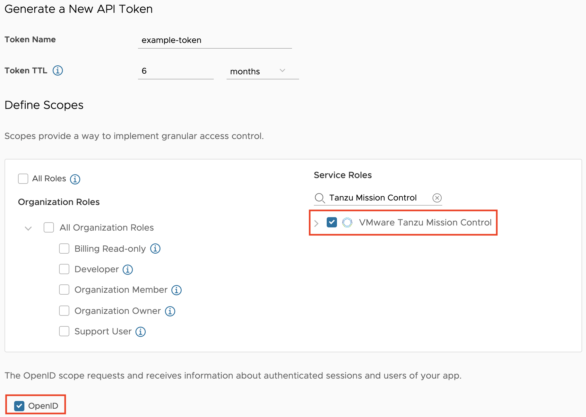

Tanzu for Kubernetes Operation product bundle includes Tanzu Mission Control, Tanzu Kubernetes Grid, Tanzu Observability and Tanzu Service Mesh
We are going to use Tanzu Mission control to build, manage lifecycle and backup Kubernetes clusters across multiple cloud providers. We will then implement policies that will help provide self-service role based access to developers, secure container runtime, forward metrics to Tanzu Observability and implement Secure communications on application services running on top of these clusters using Tanzu Service Mesh.

# SaaS Services
**Important**: For the next sections, it is vital that you  make sure to sign-in to cloud.vmware.com with your **@vmware.com** email address and select the **Tanzu End to End** organization.  Please be careful not to alter the services or configurations of the clusters in these environments as they are shared for the entire End to End Demo Environment.

Click below to sign in.  If you can't see this organization, you can self-enroll into the organization at https://via.vmware.com/tanzu-e2e-demo
```dashboard:open-url
url: https://console.cloud.vmware.com
```

## Tanzu for Kubernetes Operators Overview

Open a tab with the Tanzu for Kubernetes Operators "Day" Overview Slide
```dashboard:open-url
url: https://{{ session_namespace }}.{{ ingress_domain }}/workshop/content/images/tko.png
```

## Tanzu Mission Control

Open a tab for Tanzu Mission Control
```dashboard:open-url
url: https://tanzuendtoend.tmc.cloud.vmware.com/clusters
```

## Tanzu Observability
Open a tab to Tanzu Observability. First, you will need to sign in to the following Wavefront instance.  I would **strongly** suggest that you pre-populate the following Tanzu Observability tabs as they may take a while to load, especially while screen sharing or if network bandwidth is an issue.

- Kubernetes Cluster Dashboard for the `e2e-amer` Cluster:
```dashboard:open-url
url: https://vmware.wavefront.com/u/rNsjycZJrF?t=map-sales-sandbox
```

- Service Dashboard for `tacocat`:
```dashboard:open-url
url: https://vmware.wavefront.com/u/WYWCgR1V9d?t=map-sales-sandbox
```

- Service Dashboard > Traces for `tacocat`:
  - After opening the **TacoCat Service Dashboard**, find the **See All payments Traces** link on the upper left hand side

  - Open the Traces link in a new tab

If you are having trouble accessing this instance, make sure you have the Wavefront-sandbox app added to your Workspace One account.  You can access that app at https://myvmware.workspaceair.com/catalog-portal/ui#/apps/details/WORKSPACE-d689139a-9b94-4b6f-aa23-915763e9b149-Web-Saml20, and then try to click the links above.

## Tanzu Service Mesh
Open tab to Tanzu Service Mesh to the `e2e-demo` Global namespace by clicking the link below.  If you don't see the graph for the Global Namespace showing the `e2e-acme` and `e2e-catalog` clusters, make sure to select the **Tanzu End to End** org, close the tab, and then reopen it again with the link below.
```dashboard:open-url
url: https://prod-2.nsxservicemesh.vmware.com/global-namespaces-detail/e2e-demo/gns-topology
```

# Demo Environment Pre-Work

You should complete the pre-work below to ensure that the example commands to validate the Tanzu Mission Control policies are functioning as expected.  If you are not going to include those verification steps, you can skip the Workload Cluster kubeconfig preparation.

## Workload Cluster kubeconfig

You will need a kubeconfig from the `gke-psp-demo` cluster if you wish to validate the policies set in Tanzu Mission Control.  To fetch a kubeconfig:

- Go to the the Tanzu Mission Control tab, locate the cluster `gke-psp-demo` under the clusters page and click on it.

- Click Actions from the top right hand side of the page and click **Access This Cluster**

- Click on **View YAML** and copy the YAML config (there is a small "copy" button that will copy the entire text)

- Click **OK** button to dismiss the window.

- Go to the **Workshop** tab and open a new editor by clicking the text below:
```editor:append-lines-to-file
file: ~/kubeconfig-gke-psp-demo.yaml
text: |
```
- Once the empty file appears, paste the contents of the kubeconfig copied from the previous steps.

- Once pasted, make sure to hit `ctrl+s` to save the file.

- Login to TMC using the CLI:
```execute
tmc login
```

- In Tanzu Mission Control, fetch an API Token by clicking on the dropdown of your username in the top right hand corner, click **My Account**, click on the **API tokens** tab, click on **Generate a new API Token**. If you need to re-issue an existing token, click on **REGENERATE** to create a new one and and copy the generated token then, click **Continue**.
  - **Note**: Your API token Scope should **at least** be set to:
    - **Service Roles**: `Tanzu Mission Control`
    - **OpenID scope**: `Enabled` (box checked)



- Go back to the Workshop page, on the **Terminal** tab

- When Prompted to provide the API Token, paste the API token you just copied. Give a context name like `tmc-tko` and `aws-hosted` for **Management Cluster Name** and `aws` for **Provisioner Name**, like shown in the below snapshot.


- Validate that you are able to communicate with the GKE cluster by checking the Kubernetes server version:
```execute
kubectl --kubeconfig=kubeconfig-gke-psp-demo.yaml version --short=true
```

# Tab Staging
Reorder your tabs in this way so that your demo flow goes left to right:
- This workshop
- Tanzu for Kubernetes Operators "Day" Overview Slide
- Tanzu Mission Control (TMC)
- Tanzu Service Mesh (TSM)
- Tanzu Observability (TO) - Kubernetes Dashboard for `e2e-amer`
- Tanzu Observability (TO) - Service Dashboard for `tacocat`
- Tanzu Observability (TO) - Service Dashboard > Traces for `tacocat`
